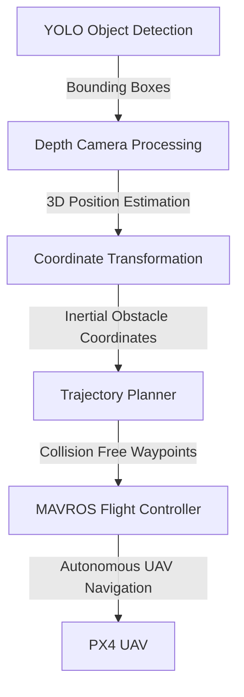

# UAV Autonomous Guidance & Object Avoidance using RealSense ROS and MAVROS
UAV Autonomous Guidance &amp; Object Avoidance using RealSense ROS and MAVROS

## **🚀 Overview**  
This repository implements an **autonomous UAV guidance system** integrating:  
✅ **Vision-based object detection** using YOLO and a depth camera  
✅ **Neural Network-based trajectory optimization** for safe UAV navigation  
✅ **MAVROS-based UAV control** using PX4 integration  
✅ **MOCAP-based position feedback** for state estimation (can also be used with GPS)  

The system detects objects, estimates their 3D position in an inertial frame, and **plans collision-free trajectories** using a trained **Neural Network (NN)**.  

## **📌 Features**  
### **🔹 Perception & Obstacle Detection**
- **YOLO-based object detection** via `darknet_ros`  
- **Depth estimation using a stereo camera**  
- **Real-time bounding box processing**  
- **3D position estimation of detected objects**  

### **🔹 Guidance & Navigation**
- **Real-time trajectory optimization** using Neural Networks (https://github.com/jp-praveen/Neural_Network_Trajectory_Generator) 
- **Successive convex optimization based** Neural Network training (https://github.com/jp-praveen/Obstacle_Avoidance_Convex_Optimization)
- **Obstacle-aware waypoint generation**  
- **Safe path execution in MAVROS offboard mode**  

### **🔹 UAV Control**
- **MAVROS based drone control** (PX4-compatible)  
- **Position updates via MOCAP system**  
- **Autonomous waypoint tracking**  
- **Failsafe modes: STABILIZED, LAND, DISARM**  

## **🛠️ System Architecture**  

## **🛠️ Usage**
### **1️⃣Hardware Prerequisites**
- **Pixhawk** 
- **RealSense D435 Stereo Camera** 
- **Companion computer** like Jetson Nano, Jetson Orin Nano or Raspberry Pi. I used Jetson Nano
- **Quadcopter Platform** like Holybro S500

### **2️⃣Software Prerequisites**
Ensure you have the following dependencies installed:
- **ROS Melodic/NOETIC or ROS2** depending on the companion computer OS
- **MAVROS** to communicate with Pixhawk
- **YOLO ROS** for obstacle detection
- **RealSense ROS** for depth estimation
- **MOCAP ROS** for state estimation
- **OpenCV & Python**

## **📊 Data Logging**
- **MOCAP Data:** mocap_data.txt
- **Trajectory Data:** nn_trajectory.txt
- **Local UAV Position:** local_position_data.txt

## **👨‍💻 Author**
Developed by Praveen Jawaharlal Ayyanathan
-   
- 